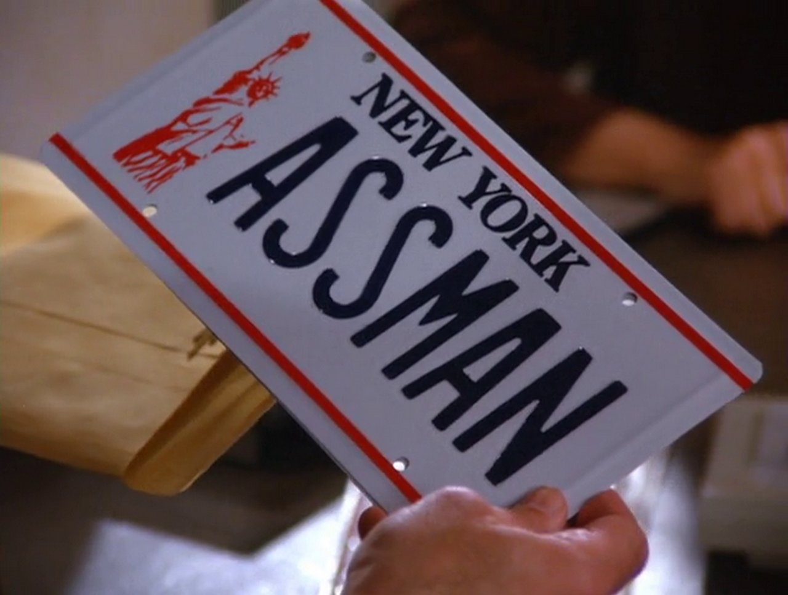

Short for "Asset Manager"

A simple standalone asset manager for games and such. Just copy `assman.h` and `assman.c` into your project and add it to your makefile or whatever it is you're using.

# API:

- **Typedefs**
  
  - `void *(*AssLoaderFn)(const char *path,  void *data)`: This is the signature for the loader function you will have to provide `AssMan_load()`. You can wrap an existing library's load function.
  
  - `void  (*AssReleaseFn)(void *asset, void *data)`: This is the signature for the unloader function you will have to provide `AssMan_load()`. You can wrap an existing library's unload function.

- **Functions**

  - `AssMan *AssMan_new(void)`: Constructs a pointer to a new Asset Manager.

  - `void AssMan_free( AssMan *assman)`: Destructs an asset manager.

  - `void AssMan_registerFiletype( AssMan *assman, const char *extension, AssLoaderFn loader, AssReleaseFn  releaser)`: Register a file `extension` with `loader` and `releaser` to asset manager `assman`. 
  
  - `void *AssMan_load( AssMan *assman, const char *path, void *load_data, void *release_data)`: Loads a file from disc if it's not allocated already, otherwise, just returns the currently allocated resource. It will load the file located at `path` using function `loader` with `load_data` as its second argument, and pass to the loaded `Asset` function `releaser` and `release_data` to use later when it needs to be unloaded from memory.
  
  - `void  AssMan_release( AssMan *assman, const char *path)`: Releases a resource if it's no longer in use anywhere else, otherwise, it decrements the refcount.

  - `void  AssMan_clearAssets( AssMan *assman,)`: Clears the entire manager of all assets.
  
  - `void  AssMan_clearRegistry( AssMan *assman,)`: Clears the entire manager of all registered file types.

# License:

Zero BSD/Public Domain
